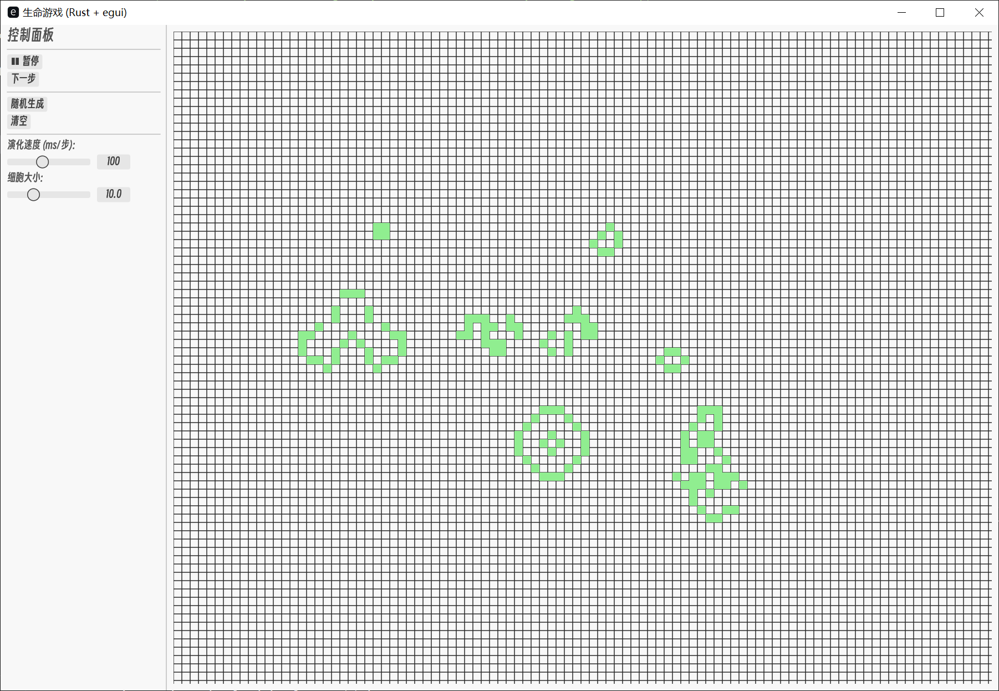

# 生命游戏 (Conway's Game of Life) - Rust & egui

<p align="center">
  
  
  
</p>

这是一个使用 [Rust](https://www.rust-lang.org/) 语言和 [egui](https://github.com/emilk/egui) 即时模式GUI库实现的康威生命游戏桌面应用。

它完全跨平台，无需任何修改即可在 Windows, macOS 和 Linux 上编译运行。这个项目旨在展示如何使用 Rust 和 egui 创建一个简单、美观且具有交互性的桌面应用。



---

## ✨ 功能特性

*   **经典的康威生命游戏规则**:
    *   存活细胞的邻居少于2个会死亡（人口过少）。
    *   存活细胞的邻居多于3个会死亡（人口过多）。
    *   存活细胞的邻居为2或3个则继续存活。
    *   死亡细胞的邻居正好为3个则会诞生新生命。
*   **交互式 GUI 面板**:
    *   **播放/暂停** 游戏演化。
    *   **单步执行** 以观察每一步的变化。
    *   **随机生成** 初始细胞图案。
    *   **清空** 整个网格。
    *   通过滑块实时**调整演化速度**和**细胞大小**。
*   **动态自适应网格**: 网格大小会根据窗口可用空间自动调整，充分利用屏幕。
*   **直观的绘制控件**:
    *   **按住鼠标左键拖动**: 在网格上绘制（添加）活细胞。
    *   **按住鼠标右键拖动**: 擦除（移除）活细胞。
*   **完全跨平台**: 一份代码，三大平台（Windows, macOS, Linux）通用。
*   **内置中文字体支持**: 界面在中文环境下可以完美显示。

## 🚀 快速开始 (Getting Started)

确保你的电脑上已经安装了 Rust 开发环境。如果尚未安装，请访问 [rustup.rs](https://rustup.rs/) 进行安装。

#### 1. 克隆本仓库

```bash
git clone https://github.com/YUZHEthefool/lifegame_gui.git
```

#### 2. 进入项目目录

```bash
cd lifegame_gui
```

#### 3. 运行项目

推荐使用 `--release` 模式运行，以获得最佳性能和流畅体验。

```bash
cargo run --release
```

程序启动后，你就可以开始探索生命游戏的奇妙世界了！

## 🎮 如何使用 (Controls)

*   **左侧控制面板 (Control Panel)**:
    *   使用按钮和滑块来控制游戏的进程和外观。
*   **主网格区域 (Main Grid)**:
    *   **按住鼠标左键拖动**: 绘制 (添加) 活细胞。
    *   **按住鼠标右键拖动**: 擦除 (移除) 活细胞。

## 🛠️ 技术栈 (Tech Stack)

*   **[Rust](https://www.rust-lang.org/)**: 核心编程语言，以其高性能和内存安全著称。
*   **[eframe](https://github.com/emilk/eframe) / [egui](https://github.com/emilk/egui)**: 一个纯 Rust 实现的、简单易用的即时模式 GUI 库，用于构建跨平台用户界面。
*   **[rand](https://crates.io/crates/rand)**: 用于生成随机的初始细胞布局。

## 📄 许可证 (License)

本项目采用 MIT 许可证。详细信息请参阅 [LICENSE](LICENSE) 文件。
